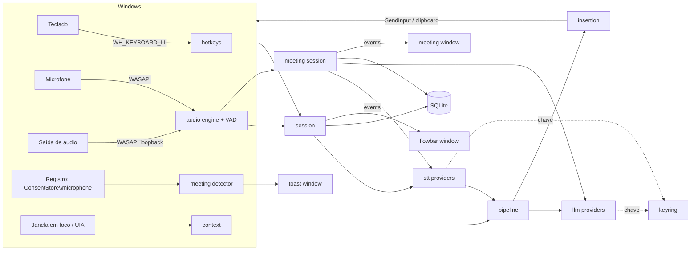
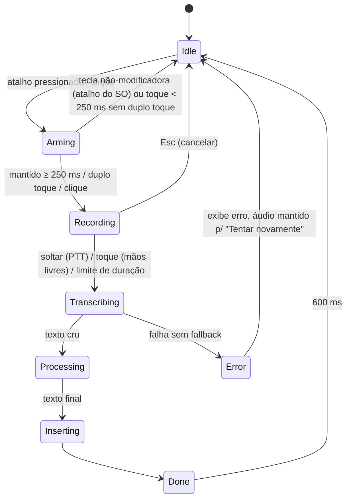
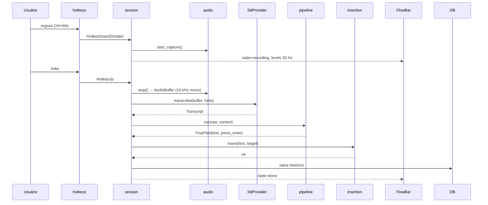

# Plano Técnico / Arquitetura

## 1. Decisão de stack

> **Base decidida: fork divergente do [Handy](https://github.com/cjpais/Handy)** (MIT, commit `29bd2c0`, v0.9.7+), renomeado para **Transcreve.ai**. A decisão e a avaliação estão no [ADR-0001](../../docs/adr/0001-fork-do-handy-como-base.md). Segue `rules/common/patterns.md` ("Skeleton Projects: clone best match as foundation") e a skill `search-first`. A coluna "Crates" mostra o que vem do Handy (**herdado**) e o que precisa ser acrescentado (**novo**).

| Camada            | Escolha                                                                                   | Crates                                                                                                                                                                         | Por quê                                                                                                                                                                                  |
| ----------------- | ----------------------------------------------------------------------------------------- | ------------------------------------------------------------------------------------------------------------------------------------------------------------------------------ | ---------------------------------------------------------------------------------------------------------------------------------------------------------------------------------------- |
| Shell desktop     | **Tauri 2**                                                                               | `tauri` 2.11 + plugins (store, autostart, single-instance, updater, clipboard, dialog, fs, log) — herdado; `tao` pinado no fork do Handy (correção de desligamento no Windows) | Binário pequeno, RAM baixa, núcleo em Rust com acesso direto às APIs do SO; múltiplas janelas transparentes.                                                                             |
| Núcleo            | **Rust** (tokio)                                                                          | `tokio`, `anyhow` — herdado; `thiserror` nos módulos novos — novo                                                                                                              | Áudio em tempo real, hooks de teclado, inferência local e FFI Win32.                                                                                                                     |
| UI                | **React 18 + TypeScript + Vite + Tailwind 4**                                             | `zustand`, `zod`, `i18next`, `sonner`, `immer`; gerenciador **bun** — herdado                                                                                                  | Estado conforme a árvore de decisão de `rules/react/patterns.md` (local → contexto → store externa como Zustand só para estado compartilhado/alta frequência). Editor de notas Markdown. |
| IPC tipado        | comandos/eventos Tauri com tipos TS gerados                                               | `tauri-specta` + `specta` — herdado                                                                                                                                            | Tipos do Rust viram `src/bindings.ts`; o envelope `ok/error` do [contracts §5](contracts.md#5-ipc-tauri) é adaptado na T-006.                                                            |
| Áudio             | captura do microfone, reamostragem para 16 kHz, ring buffer lock-free, gravação WAV, sons | `cpal`, `rtrb`, `rubato`, `hound`, `rodio` — herdado. Loopback WASAPI (reuniões) — novo, T-063                                                                                 |                                                                                                                                                                                          |
| VAD               | Silero VAD v4 + Earshot                                                                   | `vad-rs` (fork git), `earshot` — herdado                                                                                                                                       | Padrão de mercado; leve.                                                                                                                                                                 |
| STT local         | whisper (GGUF; Vulkan no Windows x86_64, CPU no ARM) · Parakeet/Moonshine (ONNX, CPU)     | `transcribe-cpp`, `transcribe-rs` — herdado                                                                                                                                    | Offline, suporta pt-BR.                                                                                                                                                                  |
| STT nuvem (v1.1+) | OpenAI, Groq, Deepgram, genérico compatível OpenAI                                        | `reqwest` — herdado; provedores + trait `SttProvider` — novo                                                                                                                   | Chave própria. O Handy não tem STT em nuvem. Fora do escopo v1 (ADR-0002): a trait `SttProvider` entra, os provedores de nuvem não.                                                      |
| LLM               | OpenAI-compatível (OpenAI, Groq, Ollama, OpenRouter) + Anthropic                          | `llm_client.rs` — herdado; trait `LlmProvider` — novo                                                                                                                          | Limpeza, Command Mode, resumos. Roteamento de modelo por tarefa conforme skill `cost-aware-llm-pipeline`.                                                                                |
| Atalhos           | hook de teclado de baixo nível                                                            | `handy-keys` (padrão) com fallback `tauri-plugin-global-shortcut` — herdado                                                                                                    | Combos só de modificadores; captura de atalho na UI.                                                                                                                                     |
| Inserção          | clipboard Win32 transacional + teclas sintéticas                                          | `paste_tx/windows.rs` (crate `windows`), `enigo` — herdado                                                                                                                     | Já faz snapshot multi-formato e exclui o texto do histórico do clipboard (F005).                                                                                                         |
| Win32             | crate `windows` (`SendInput`, clipboard, UI Automation, registro, sessões WASAPI)         | `windows` 0.61, `winreg`, `webview2-com` — herdado; features novas conforme cada tarefa                                                                                        | Onde plugins Tauri não alcançam.                                                                                                                                                         |
| Persistência      | SQLite com migrações (+ FTS5 — novo) · `settings.json`                                    | `rusqlite` (bundled), `rusqlite_migration`, `tauri-plugin-store` — herdado                                                                                                     | Local, busca full-text; `settings.json` conforme [data-model](data-model.md).                                                                                                            |
| Segredos          | cofre do SO                                                                               | `keyring` — novo (o Handy guarda chaves em texto puro no `settings.json`; migrar na T-016)                                                                                     | `rules/common/security.md`: "secret manager".                                                                                                                                            |
| Logs              | arquivo, sem conteúdo transcrito nem segredos                                             | `log` + `tauri-plugin-log` — herdado                                                                                                                                           | `rules/rust/security.md` aceita "`tracing` or `log`".                                                                                                                                    |

**Alternativas rejeitadas**: Electron (pesado; addons nativos frágeis); C#/WinUI (não portável); Python (distribuição e latência).

## 2. Processos e janelas

Um único processo Tauri (núcleo Rust) com várias webviews:

| Janela       | Tipo                                              | Focável                      | Descrição                                                                                |
| ------------ | ------------------------------------------------- | ---------------------------- | ---------------------------------------------------------------------------------------- |
| `flowbar`    | transparente, sem borda, topmost, fora da taskbar | **Não** (`WS_EX_NOACTIVATE`) | [F001](../features/001-flow-bar/spec.md)                                                 |
| `toast`      | idem                                              | **Não**                      | Reunião detectada, avisos — [F008](../features/008-meeting-detection/spec.md)            |
| `hub`        | normal                                            | Sim                          | Histórico, notas, reuniões, configurações — [F010](../features/010-hub-settings/spec.md) |
| `meeting`    | normal (pode ser rota do hub)                     | Sim                          | Notas/transcrição ao vivo — [F009](../features/009-meeting-notetaker/spec.md)            |
| `onboarding` | normal                                            | Sim                          | Primeiro uso                                                                             |

## 3. Módulos do núcleo

Com o fork ([ADR-0001](../../docs/adr/0001-fork-do-handy-como-base.md)), **mantém-se a estrutura do Handy** (padrão _manager_ + `commands/` + eventos). Domínios novos entram como módulos próprios, organizados por domínio como pede `rules/rust/coding-style.md`. Quando um arquivo herdado com mais de 800 linhas for alterado, ele é dividido em submódulos do mesmo domínio. A árvore abaixo mostra o que é herdado e o que é novo:

```
src-tauri/src/
├── lib.rs / main.rs          # [herdado] bootstrap, plugins, janelas, managers no state do Tauri
├── tray.rs, tray_i18n.rs     # [herdado] bandeja (F010)
├── transcription_coordinator.rs # [herdado → estender] Idle/Recording/Processing → máquina completa da F002 (session)
├── shortcut/                 # [herdado → estender] handy-keys + tauri; matcher, supressão, double-tap (F002)
├── audio_toolkit/            # [herdado] captura, reamostragem, visualizer, VAD (silero/earshot), text.rs (vícios)
├── managers/
│   ├── audio.rs              # [herdado] gravação e dispositivos
│   ├── model.rs, model/      # [herdado] catálogo, download retomável + SHA-256 (F003)
│   ├── transcription.rs      # [herdado → refatorar] motores locais → provedores atrás do trait SttProvider
│   └── history.rs            # [herdado → estender] SQLite + migrações; FTS5, status de inserção (F010)
├── paste_tx/, clipboard.rs, input.rs # [herdado → estender] inserção (F005): + UIPI, clipboard_only, resultado
├── llm_client.rs             # [herdado → estender] OpenAI-compat + Anthropic → trait LlmProvider
├── overlay.rs                # [herdado → estender] janela não-focável → Flow Bar (F001)
├── settings.rs               # [herdado] settings.json (tauri-plugin-store) versionado
├── commands/                 # [herdado] handlers IPC (tauri-specta)
├── stt/                      # [novo] trait SttProvider + openai, groq, deepgram, openai_compat (F003)
├── pipeline/                 # [novo] pipeline de texto puro: snippets, substituições, perfis, salvaguardas (F004)
├── secrets/                  # [novo] keyring (F011)
├── context/                  # [novo] app/janela em foco, seleção, perfis de app
├── command_mode/             # [novo] F006
├── notes/                    # [novo] scratchpad (F007)
├── meeting/                  # [novo] detector (F008) + notetaker, loopback, sumarização (F009)
└── platform/windows/         # [novo] Win32 que não couber nos módulos acima (UIA, ConsentStore, elevação)
```

Frontend: mantém-se a estrutura do Handy. As janelas novas (`toast`, `meeting`) seguem o padrão de `src/overlay/` (entrada HTML própria).

```
src/                           # frontend React
├── components/               # [herdado → estender] telas do Hub, configurações, onboarding (F010)
├── overlay/                  # [herdado → estender] Flow Bar (F001)
├── toast/                    # [novo] reunião detectada, avisos (F008)
├── meeting/                  # [novo] janela da reunião (F009)
├── stores/                   # [herdado] Zustand
├── i18n/locales/             # [herdado] pt, en e demais idiomas (seleção na T-005)
└── bindings.ts               # [herdado] tipos gerados pelo tauri-specta (IPC)
```

## 4. Visão de componentes



## 5. Máquina de estados da sessão de ditado



Detalhes na [F002](../features/002-hotkeys-dictation/spec.md). A gravação começa já em `Arming` (o áudio é descartado se voltar a `Idle`), para não cortar a primeira sílaba.

## 6. Sequência do ditado



## 7. Concorrência

- **Hook de teclado**: thread dedicada com loop de mensagens Win32. O callback só classifica o evento e envia por canal (< 1 ms), senão o Windows remove o hook.
- **Callback de áudio**: escreve num ring buffer lock-free sem alocar nem bloquear (buffers pré-alocados e mutáveis aqui são "mutação exigida", permitida por `rules/rust/coding-style.md`; fora do hot path vale imutabilidade). Uma task tokio consome, reamostra, calcula RMS (para a Flow Bar) e alimenta VAD/buffers.
- **Inferência local**: thread bloqueante dedicada (`spawn_blocking`/worker), uma inferência por vez; fila FIFO.
- **Rede**: tokio + reqwest com timeouts por operação.
- **Modelo local**: carregado sob demanda (ou pré-carregado), descarregado após N min ocioso.

## 8. Orçamentos de desempenho

| Métrica                                                | Meta                                                           |
| ------------------------------------------------------ | -------------------------------------------------------------- |
| Atalho → gravação ativa (primeiro sample no buffer)    | ≤ 100 ms                                                       |
| Atalho → feedback visual na Flow Bar                   | ≤ 50 ms                                                        |
| Soltar → texto inserido (10 s de fala, nuvem, sem LLM) | p50 ≤ 800 ms, p95 ≤ 1,5 s                                      |
| Idem com limpeza LLM                                   | p50 ≤ 1,3 s, p95 ≤ 2,5 s (timeout do LLM → insere sem limpeza) |
| Idem local, large-v3-turbo GPU / Parakeet CPU          | p50 ≤ 1,5 s                                                    |
| RAM ociosa (sem modelo)                                | ≤ 150 MB                                                       |
| CPU ociosa                                             | ≤ 1 %                                                          |
| Instalador                                             | ≤ 30 MB (modelos baixados à parte)                             |

## 9. Build, distribuição, observabilidade

- Instalador **NSIS/MSI** via bundler do Tauri; **assinatura de código** antes de distribuir (hooks de teclado + SendInput sem assinatura geram alertas do SmartScreen/antivírus).
- Auto-update assinado (`tauri-plugin-updater`), como o Wispr, com **endpoint e chave de assinatura próprios**: o fork não pode apontar para o updater do Handy.
- whisper via `transcribe-cpp` (herdado): no Windows x86_64, backends dinâmicos (CPU por ISA + Vulkan, escolhidos em runtime); no ARM, CPU estático. O pipeline de build do Handy (`.github/workflows/build.yml`) já trata ONNX Runtime sem AVX2 e a assinatura das DLLs.
- Logs com `log` + `tauri-plugin-log` (herdado; `rules/rust/security.md` aceita "`tracing` or `log`") em `%LOCALAPPDATA%\br.com.creator4all.transcreve.ai\logs` (`app_log_dir` do Tauri). **Texto transcrito e chaves nunca são logados** — são dados sensíveis do usuário (`rules/common/security.md`: "error messages don't leak sensitive data"). A T-003 audita os logs herdados.
- CI: os workflows do Handy são estendidos (T-002) para `windows-latest` com os checks exigidos pelas rules (ver §11). Hoje eles rodam `cargo test` só no Ubuntu e não rodam clippy, cobertura, `cargo audit` nem `cargo deny`.
- **Atribuição e marca**: manter o `LICENSE` MIT com o copyright do Handy e acrescentar o nosso; trocar nome, ícones, logo, identificador do bundle e `sponsor-images/` (o README do Handy exige marca própria em forks).

## 10. Riscos e mitigações

| Risco                                                                                                                            | Impacto | Mitigação                                                                                                                                                      |
| -------------------------------------------------------------------------------------------------------------------------------- | ------- | -------------------------------------------------------------------------------------------------------------------------------------------------------------- |
| Antivírus marcar o app como keylogger (hook global)                                                                              | Alto    | Assinatura de código; hook só compara com combinações configuradas; nada é armazenado; política pública de privacidade; documentação.                          |
| Win solto após `Ctrl+Win` abre o Menu Iniciar                                                                                    | Médio   | Técnica de "menu mask key": injetar uma tecla neutra (VK 0xE8) antes do key-up do Win quando o atalho foi consumido.                                           |
| `Win+Space` troca o layout do teclado                                                                                            | Médio   | Se configurado pelo usuário, o hook suprime o evento; alerta de conflito na UI.                                                                                |
| Janela alvo elevada (admin) bloqueia `SendInput` (UIPI)                                                                          | Médio   | Detectar elevação do alvo → copiar para clipboard e avisar.                                                                                                    |
| Whisper "alucina" em silêncio ("Legendas pela comunidade Amara.org", "Obrigado por assistir")                                    | Médio   | VAD antes da inferência, limiar `no_speech_prob`, lista de bloqueio.                                                                                           |
| Dispositivo de áudio em modo exclusivo / troca de fone no meio                                                                   | Médio   | Reabrir stream no evento de mudança de dispositivo padrão; marcar lacuna na transcrição.                                                                       |
| Transparência de WebView2 / flicker ao redimensionar                                                                             | Baixo   | Janela de tamanho fixo + click-through dinâmico (ver F001).                                                                                                    |
| Detecção de Meet em aba não ativa                                                                                                | Baixo   | Heurística com memória + extensão de navegador opcional (P2).                                                                                                  |
| LLM responder ao conteúdo ditado em vez de só limpar                                                                             | Alto    | Prompt com delimitadores, regras explícitas, checagem de razão de tamanho, fallback determinístico (F004); regressão coberta por evals (skill `eval-harness`). |
| Base herdada (Handy) não funcionar bem no Windows — só foi avaliada lendo o código                                               | Alto    | Portão de smoke na T-001; se falhar de forma estrutural, reabrir o [ADR-0001](../../docs/adr/0001-fork-do-handy-como-base.md) com a alternativa "compor".      |
| Dívida herdada em relação às rules (11 arquivos com mais de 800 linhas, cerca de 133 `unwrap` em produção, cobertura não medida) | Médio   | T-001a (baseline + gates) e regra de "deixar melhor ao tocar"; ver §11.                                                                                        |
| Dependências via git (forks de `rdev`, `vad-rs`, `rodio`, `hf-hub`, `tao`) e fator ônibus do upstream                            | Médio   | `cargo deny` com fontes git explicitamente permitidas e pinadas por `rev`; fork divergente com cherry-pick mensal, sem depender de merges do upstream.         |

## 11. Engenharia governada pelas ECC rules

As specs não definem práticas de engenharia; elas vêm das rules e skills abaixo. Esta tabela é só um mapa para quem implementa.

| Assunto                                                                                         | Rule                                                                                                       | Skills / agentes ECC                                                                                                                                                                                                                                                                                                                                                           |
| ----------------------------------------------------------------------------------------------- | ---------------------------------------------------------------------------------------------------------- | ------------------------------------------------------------------------------------------------------------------------------------------------------------------------------------------------------------------------------------------------------------------------------------------------------------------------------------------------------------------------------ |
| Pesquisa e reuso antes de codar                                                                 | `common/development-workflow.md` (passo 0), `common/patterns.md`                                           | `search-first`, `ecc:planner`                                                                                                                                                                                                                                                                                                                                                  |
| TDD e cobertura ≥ 80% (unit, integração, E2E)                                                   | `common/testing.md`, `rust/testing.md`, `react/testing.md` (metas por camada)                              | `tdd-workflow`, `rust-testing`, `react-testing`, `ecc:tdd-guide`                                                                                                                                                                                                                                                                                                               |
| E2E das telas (webviews)                                                                        | `typescript/testing.md` (Playwright)                                                                       | `e2e-testing`, `ecc:e2e-runner`                                                                                                                                                                                                                                                                                                                                                |
| E2E de fluxos nativos (atalho → texto em outro app)                                             | `common/testing.md`                                                                                        | `windows-desktop-e2e` (pywinauto + UI Automation)                                                                                                                                                                                                                                                                                                                              |
| Estilo, erros (`thiserror`/`anyhow`, sem `unwrap`), padrões (traits, newtypes, enums de estado) | `common/coding-style.md`, `rust/coding-style.md`, `rust/patterns.md`, `typescript/coding-style.md`         | `rust-patterns`, `react-patterns`                                                                                                                                                                                                                                                                                                                                              |
| Validação na fronteira (IPC, APIs externas, arquivos importados)                                | `common/coding-style.md`, `rust/security.md` ("parse, don't validate"), `typescript/coding-style.md` (Zod) | —                                                                                                                                                                                                                                                                                                                                                                              |
| Segurança (segredos, entrada, arquivos, APIs externas, dependências)                            | `common/security.md`, `rust/security.md`, `typescript/security.md`                                         | `security-review`, `ecc:security-reviewer`                                                                                                                                                                                                                                                                                                                                     |
| Revisão de código                                                                               | `common/code-review.md`                                                                                    | `ecc:code-reviewer`, `ecc:rust-reviewer`, `ecc:typescript-reviewer`, `ecc:react-reviewer`                                                                                                                                                                                                                                                                                      |
| Verificação antes de concluir                                                                   | `common/development-workflow.md`                                                                           | `verification-loop`, `quality-gate`                                                                                                                                                                                                                                                                                                                                            |
| Design visual do frontend                                                                       | `web/design-quality.md`, `web/performance.md`                                                              | `frontend-design-direction`, `design-system`, `make-interfaces-feel-better`                                                                                                                                                                                                                                                                                                    |
| Acessibilidade                                                                                  | `react/testing.md` (axe)                                                                                   | `accessibility`, `frontend-a11y`                                                                                                                                                                                                                                                                                                                                               |
| Tradução (pt-BR/en)                                                                             | —                                                                                                          | `i18n-sync`                                                                                                                                                                                                                                                                                                                                                                    |
| Latência / benchmarks                                                                           | —                                                                                                          | `benchmark`, `latency-critical-systems`                                                                                                                                                                                                                                                                                                                                        |
| Qualidade dos prompts de LLM                                                                    | —                                                                                                          | `eval-harness`, `ai-regression-testing`                                                                                                                                                                                                                                                                                                                                        |
| Custo/roteamento de LLM                                                                         | `common/performance.md`                                                                                    | `cost-aware-llm-pipeline`                                                                                                                                                                                                                                                                                                                                                      |
| Git e commits                                                                                   | `common/git-workflow.md` (conventional commits)                                                            | `git-workflow`, `/ecc:prp-commit`                                                                                                                                                                                                                                                                                                                                              |
| Hooks pós-edição (`cargo fmt`, `clippy`, `check`)                                               | `rust/hooks.md`                                                                                            | hooks do plugin ECC                                                                                                                                                                                                                                                                                                                                                            |
| Código herdado do Handy                                                                         | todas as acima                                                                                             | As rules valem integralmente para código **novo ou alterado**. Arquivo herdado com mais de 800 linhas é dividido quando for alterado; `unwrap` herdado é removido no trecho alterado; a cobertura total sobe em catraca (baseline da T-001a → ≥ 80%), e nenhum PR pode reduzi-la. As exceções ficam registradas no [ADR-0001](../../docs/adr/0001-fork-do-handy-como-base.md). |
