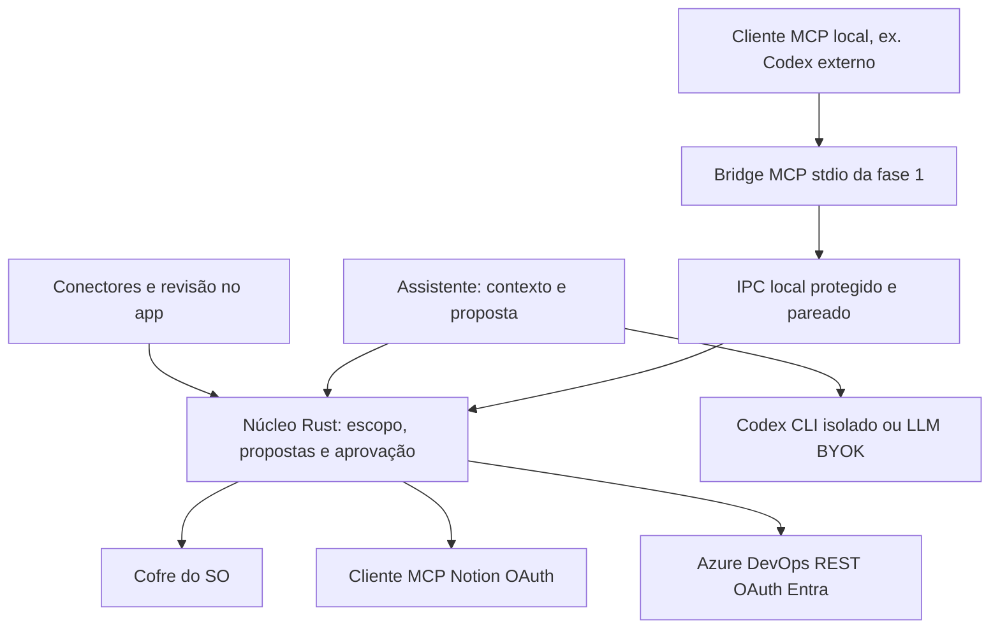

# F013 — Plano técnico e contratos propostos

**Status**: proposto, não implementado · **Data**: 2026-10-05

Direção atual: OAuth confirmado pelo usuário; [oauth.md](oauth.md) define login, callback, armazenamento e renovação. PAT é alternativa pesquisada, fora da jornada principal.

## Ordem confirmada de entrega

[notetaker.md](notetaker.md) define duas fases obrigatórias: primeiro configuração/instalação pertinente de MCPs, OAuth, catálogo/defaults e leitura; depois ações no resumo, sugestões de itens Azure e vínculos/publicações. A fachada MCP deixa de ser um incremento posterior às ações. Compartilhar a política no núcleo; fase 1 anuncia somente tools de leitura, fase 2 adiciona prepare/status de proposta. Nenhuma aprovação MCP pública.

## Arquitetura



Núcleo no backend, `connectors/` com tipos/política/journal e adapters `notion`/`azure_devops`, seguindo managers/commands existentes. Reusar `reqwest`, cofre, logs redigidos, cancelamento e controle offline; extrair somente infraestrutura compartilhável. UI não faz requests autenticados. Bindings gerados por specta; nenhum SDK de serviço no React.

Fase 2 não altera o trait de texto. Assistente coleta contexto por comandos explícitos e pede proposta estruturada como texto; parsing/validação do backend é obrigatório. Resposta inválida nunca se transforma em ação. Quando IA não existe, formulário de exportação usa o mesmo contrato.

Fase 1 Notion já requer cliente MCP HTTP OAuth no backend; isso é diferente de expor MCP próprio. Usar SDK oficial e mapping de ferramentas allowlisted, preservando aprovação no núcleo.

Bridge da fase 1 é processo stdio separado, com SDK Rust oficial pinado após spike. Só encaminha chamadas ao app; não acessa tokens OAuth diretamente nem cria segunda instância Tauri. Avaliar crate de biblioteca compartilhada vs módulo isolado no spike; evitar reestruturar todo backend só para esta feature.

Bridge conecta a named pipe no Windows (ACL do usuário, sessão e local-only) ou Unix domain socket nos ports (permissão 0600/diretório 0700). Pareamento aprovado no Hub gera grant revogável, sem acesso a todas as conexões por padrão. Credencial local no cofre, separada de tokens dos serviços; IPC verifica grant, usuário, versão e escopo em cada chamada. App deve estar ativo; bridge não dispara gravação nem autoabre janela. Se esta fronteira não puder ser comprovada, o gate de MCP da fase 1 fica pendente; não declarar fase 1 concluída nem liberar publicação da fase 2.

Usuário malicioso com controle completo da própria conta/SO não está isolado pelo IPC; o objetivo é prevenir acesso entre usuários e chamadas acidentais/não pareadas, não alegar sandbox forte contra malware do mesmo usuário.

## Contratos de destino e vínculo

`DestinationDefaults`: connection_id, organization/workspace, project_id, team_id, backlog_level_id, area_path, work_item_type? e sprint_policy = ask | fixed(iteration_id/path) | current_team. Validar referências reais; salvar por conexão/projeto/equipe sem segredo. Override de proposta não altera defaults.

`ActionDraft`: meeting_id, summary_version/hash e snapshot do conteúdo aprovado; Azure inclui project/team, tipo, pai opcional, Area/Iteration Path; Notion inclui page_id e modo link_only | append_summary | create_subpage. Defaults são resolvidos ao preparar, exibidos e fingerprintados; mudança invalida aprovação. Revalidar ao enviar sem mover destino silenciosamente.

`MeetingRemoteLink`: meeting_id, summary_version/hash, connection_id, service, remote_id/url, destination, operation_id e publication_status/time. Persistir vínculo depois de sucesso; vinculação sem envio é marcada linked e não published. Não guardar resposta OAuth no vínculo. Regenerar/editar informa divergência e não reenvia; journals/links sobrevivem reinício e não vazam entre reuniões.

Catálogos Azure: projetos/equipes, backlogs/níveis, schema de tipos/campos, áreas, iterações de equipe e candidatos de pai. Conexão não autoriza todos os projetos. Usar IDs/path reais, caches curtos com invalidação por conta/projeto e revalidação no preparo/envio. Task pode exigir pai para aparecer na estrutura esperada; não mapear apenas um campo fictício backlog.

## Modelo de dados

| Tipo                  | Campos e invariantes                                                                                                            |
| --------------------- | ------------------------------------------------------------------------------------------------------------------------------- |
| ConnectorConfig       | connection_id, kind, label, auth_mode, enabled, scope, policy_revision; metadados sem segredo                                   |
| ConnectorScope        | Notion roots/data_source_ids; Azure organization/project_ids; IDs canônicos verificados                                         |
| CredentialRef         | chave do cofre por connection_id; não serializa valor                                                                           |
| ConnectorCapabilities | leitura e operações permitidas verificadas; escrita pode ser unknown até validação de scopes/permissão                          |
| RemoteDocument        | serviço, ID, URL validada, título, trechos, revisão quando disponível, truncation, cursor opaco                                 |
| ActionDraft           | operation_id, connection_id, ação enumerada, destino tipado, payload tipado, expected_revision?, origem local?                  |
| Approval              | vínculo ao hash canônico de draft + policy_revision + usuário; TTL proposto 5 minutos, uso único; só backend/UI confiável emite |
| OperationRecord       | ID, estado, timestamps, fingerprint, IDs remotos, resultado/código de erro; sem segredo                                         |
| McpGrant              | client_id, connections, capacidades, expiry, revocation; não é aprovação para escrita                                           |

ActionDraft e OperationRecord também registram `owner = ui | {client_id, grant_id}` e session_id, definidos pelo backend a partir do canal autenticado. Consulta de status/proposta verifica owner e grant ativo em cada chamada; ID conhecido não concede acesso. Hub pode revisar operações de clientes pareados, com origem visível. Revogação impede novas consultas MCP e cancela propostas pendentes do grant.

Metadados de conexão ficam no store atual com schema versionado; journal no SQLite existente via migração incremental. Estado não deve ser perdido em crash depois do envio. Persistir payload necessário à reconciliação em armazenamento local protegido, não em log; TTL proposto 24 h após término/desconhecido, com aviso antes de descarte. Journal de metadados segue retenção configurada, padrão proposto 30 dias. Fingerprint não prova idempotência remota.

Ao reiniciar, `executing` sem resposta confirmada vira `outcome_unknown`. Nunca publicar automaticamente. Antes do envio persistir intenção/estado; após resposta salvar ID remoto. Sem mecanismo de idempotência remoto comprovado, conciliar manualmente por consulta e confirmação do usuário.

## Contratos lógicos do núcleo

| Operação             | Entrada                                           | Saída / política                                                        |
| -------------------- | ------------------------------------------------- | ----------------------------------------------------------------------- |
| configure_connection | config tipada, segredo via write-only             | config sem segredo; valida formato/host; nenhuma consulta implícita     |
| test_connection      | connection_id, destino                            | identity_hint, access, capacidades conhecidas/unknown; leitura mínima   |
| query                | connection_id, filtro estruturado, cursor?, limit | RemoteDocument[] limitado, next_cursor?, truncation                     |
| read                 | connection_id, ID tipado                          | documento permitido, sem follow de links arbitrários                    |
| prepare_action       | ActionDraft                                       | preview validada, campos obrigatórios/conflitos; sem escrita remota     |
| approve_action       | operation_id, fingerprint, policy_revision        | aprovação somente pela UI confiável; não exposta em MCP/modelo          |
| execute_action       | operation_id                                      | relê política/aprovação/offline, consome autorização e atualiza journal |
| revoke_connection    | connection_id                                     | cancela pendentes, revoga grants e segredo; confirma sem retornar valor |

Erros próprios: AuthInvalid, PermissionDenied, ResourceUnavailable, PolicyDenied, Offline, RateLimited, Timeout, PayloadTooLarge, InvalidSchema, RevisionConflict, Cancelled, OutcomeUnknown, UnsupportedCapability. `404` pode esconder acesso negado; não afirmar que recurso definitivamente não existe.

Backend compõe WIQL/JSON Patch apenas com filtros/fields allowlisted, escaping e limites. Adapter Notion mapeia tools MCP testadas para schema/destinos, propriedades e árvore de páginas; filhos/IDs precisam ser comprovados dentro do escopo. Search amplo só poderá retornar metadados após filtragem de escopo comprovada; preferir consulta em data sources configurados na fase 1. Schema arbitrário não representa campo gravável automaticamente.

## MCP proposto

Os nomes abaixo são do nosso contrato, não nomes dos MCPs dos fornecedores. JSON Schema tipado, descrições com efeito e limites; anotações MCP são dicas, não a fronteira de autorização.

| Tool                                          | Entrada                           | Efeito                                                                |
| --------------------------------------------- | --------------------------------- | --------------------------------------------------------------------- |
| connectors_list                               | nenhum segredo                    | lista apenas conexões liberadas ao cliente                            |
| notion_query / notion_read                    | connection_id, filtro/ID e limite | leitura allowlisted                                                   |
| azure_query_work_items / azure_read_work_item | connection_id, projeto/filtro/ID  | leitura allowlisted                                                   |
| connector_prepare_action                      | ação enumerada/destino/payload    | cria rascunho local e retorna operation_id/preview; não publica       |
| connector_operation_status                    | operation_id                      | consulta estado de operação do cliente, sem payload de outras sessões |

Fase 1 anuncia somente list/query/read. `connector_prepare_action` e status de propostas são disponibilizados após o gate da fase 2; o exemplo completo abaixo representa essa fase.

Não existe `approve`, `execute_raw_request` ou ferramenta de publicação sem UI. O app confirma e executa; cliente consulta status depois. A resposta da tool não fica pendente esperando humano, evitando timeout de cliente durante aprovação. `tools/list` e `tools/call` são filtrados; validar novamente no núcleo.

Exemplo ilustrativo para exportação futura, nunca escrito no Codex por esta tarefa:

```toml
[mcp_servers.transcreve]
command = "C:/CAMINHO-DO-INSTALADOR/transcreve-connectors-mcp.exe"
args = ["--stdio"]
enabled_tools = ["connectors_list", "notion_query", "notion_read", "azure_query_work_items", "azure_read_work_item", "connector_prepare_action", "connector_operation_status"]
```

O caminho é placeholder; o exportador gera caminho real verificado, sem tokens OAuth e sem grant secreto. MCP stdio usa stdout exclusivamente para protocolo e stderr redigido. Nenhum download `npx @latest` em produção.

## Consulta de conectores pelo assistente (fase 2)

O assistente do app é somente leitura sobre conectores, por construção: nenhuma capability de escrita é exposta nesse caminho (FR-013-33). A consulta parte de comando explícito do usuário na UI do assistente — anexar conexão + escopo da consulta (ex.: work items do projeto P, sprint atual, página Notion autorizada) — nunca inferido de prosa ambígua.

Implementação por injeção de contexto, estendendo `assistant/context.rs`: o backend executa `connectors::query`/`read` sob a policy de escopo, rotula o bloco como dado remoto não confiável com links de origem, trunca dentro do orçamento de contexto (NFR-013-02) e concatena ao prompt. Funciona igual em Codex CLI e BYOK porque não exige tool calling. Falha de consulta é fail-open para o turno (contexto vazio + aviso na resposta), nunca bloqueia o assistente.

Tool calling iterativo (o modelo decidir buscar sozinho) é incremento posterior opcional via `AgentProvider`, com os limites já propostos (6 calls/turno, 60 s) e a mesma policy; mesmo nesse modo só existem tools de leitura.

## Compatibilidade Codex e BYOK

- Fase 2: caminhos iguais de contexto/proposta para Codex e OpenAI-compatível/Anthropic existentes; a IA só propõe. Limites e instruções de dados não confiáveis pertencem ao host. Não expandir prompts de resumo para agir em conectores.
- Fase 1: usuário adiciona bridge ao Codex externo. O login Codex e a autorização OAuth dos serviços permanecem independentes. Preservar políticas administradas do cliente; não configurar aprovação irrestrita ou ignorar requisitos corporativos.
- P2 interno: spike separado confirma binário instalado, possibilidade de fornecer somente nosso MCP sob configuração controlada e comportamento de exec/headless. Sem prova de isolamento, usar contexto/propostas da fase 2; não silenciar incompatibilidade como sucesso.
- P2 BYOK: novo contrato `AgentProvider`/capacidade, separado de `LlmProvider::complete`; host chama MCP ou núcleo local. APIs OpenAI-compatíveis variam em tool calling. Limites propostos de 6 tool calls/turno e 60 s por turno antes de liberar agent loop; nenhuma fallback automática de modelo/provider.
- MCP remoto próprio não é necessário para BYOK. Se futuro cliente cloud exigir HTTP público, usar HTTPS e autorização MCP por cliente/audiência, isolamento e rate limit; não encaminhar tokens dos serviços como credencial do gateway. Reabrir F011/ADR antes de hospedar.

## Impactos nas specs atuais

F013 é proposta de expansão, não revoga silenciosamente contratos existentes. Antes de implementar, T-094 deve registrar a exceção aprovada na constituição I/II (paridade Wispr e desvio único), F011 FR-07 (destinos de rede), FR-11 (transparência), FR-22 (ferramentas), FR-27 (servidores) e F012 NFR-02 (isolamento CLI). Contratos §3 permanecem texto; F013 fase 2 só permite backend executar ação tipada confirmada. Plano, data-model e contratos gerais devem apontar para F013 quando a decisão virar accepted.

Não elevar F013 ao release v1 nem alterar T-090 concluída por consequência deste planejamento. Não implementar tool calling geral no resumo/ditado.

## Sequência e evidências de entrega

**Fase 1**: T-094 (gates/auth/reuso) → T-095/T-096 (conexões/adapters e leitura) → T-101 (UI conectar/diagnóstico) → T-102 (catálogos/defaults); T-099 instala/disponibiliza fachada MCP e comprova leitura. Checkpoint fase 1 da T-100 inclui OAuth persistente, defaults e cliente MCP real; liberar fase 2 somente após esse gate, sem exigir escrita para provar leitura.

**Fase 2**: T-097 (propostas da IA/manual, aprovação e journal) → T-098 (ações no resumo e revisão) e T-103 (vínculos persistentes); T-104 (consulta de leitura pelo assistente) pode correr em paralelo, pois é superfície independente. T-095/T-096 ganham criação/append/relacionamentos tipados nesta fase. Checkpoint final T-100 demonstra publicação real, escolha de sprint/backlog/pai, providers, reconciliação, estado da reunião e consulta somente-leitura pelo assistente.

Verificação ECC: testes RED/GREEN, cobertura >=80% do escopo, revisão segurança/Rust/React, checks pertinentes e aceitação Windows autenticada. Registro de mocks, CLI e UI nativa separadamente; não afirmar ports sem execução própria. Evidências devem distinguir gates das duas fases.
Sem credenciais fornecidas, aceite autenticado permanece pendente; especificação não precisa de login real. Evidências futuras em `docs/design/t100-connectors-validation.md`, sem tokens, conteúdo confidencial ou prints de tela inteira.
