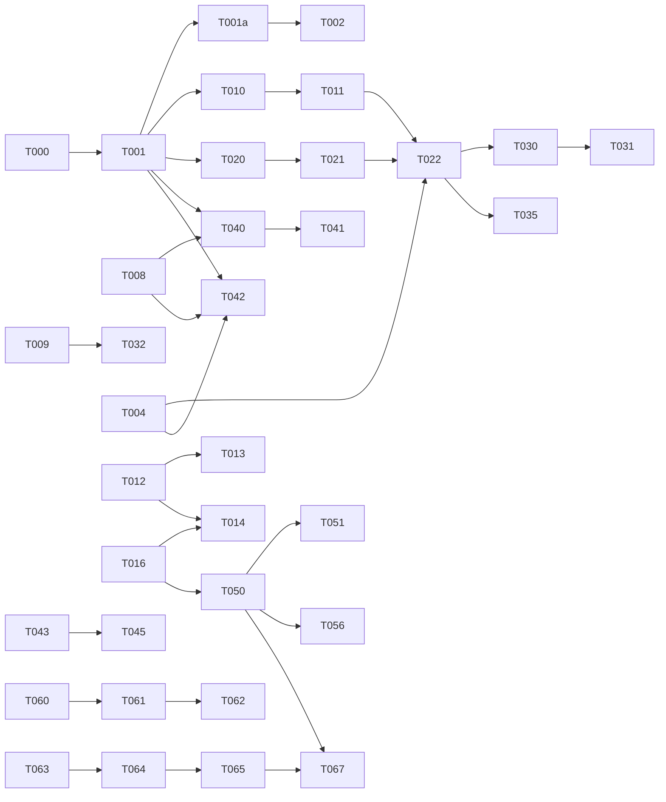

# Plano de implementação (tarefas)

Legenda: `[P]` = paralelizável com as outras `[P]` da fase · **Refs** = requisitos atendidos · marque `[x]` ao concluir.

Base do código: **fork divergente do Handy** ([ADR-0001](../docs/adr/0001-fork-do-handy-como-base.md)). Cada tarefa leva uma destas marcações:

- **Adaptar**: o Handy já tem a funcionalidade. A tarefa é verificar contra os `AC-*`, escrever os testes que faltam, trazer o trecho alterado para o padrão das rules e renomear.
- **Estender**: o Handy tem uma parte. Reaproveitar o que existe e construir o que falta (a lacuna vem descrita).
- **Migrar**: o Handy faz de um jeito que as rules/specs não aceitam; trocar preservando os dados do usuário.
- **Sem marcação**: construir do zero.

Código herdado segue a política do [plan.md §11](architecture/plan.md#11-engenharia-governada-pelas-ecc-rules): as rules valem para o que for alterado, e a cobertura sobe em catraca.

## Escopo v1

Conforme o [ADR-0002](../docs/adr/0002-escopo-v1.md), o release v1 = **ditado + notetaker de reuniões + todas as telas**. Tarefas marcadas **(v1.1+)** estão fora do escopo; as demais listadas nas fases 0–3 são v1. O release é um `bun run tauri build` local (NSIS, sem assinatura/updater — T-049 não se aplica).

## Fluxo de cada tarefa

Não há definição de pronto própria: vale o workflow das ECC rules (`rules/common/development-workflow.md`, `testing.md`, `code-review.md`, `git-workflow.md`). Na prática:

1. **Pesquisa/reuso** antes de adicionar dependência ou código novo — skill `search-first`.
2. **Planejamento** para tarefas complexas — `ecc:planner`.
3. **TDD** (RED → GREEN → REFACTOR) com a cobertura exigida pelas rules — `tdd-workflow` / `ecc:tdd-guide`, `rust-testing`, `react-testing`. Os `AC-*` da spec viram os testes.
4. **Revisão** — `ecc:code-reviewer` + `ecc:rust-reviewer` / `ecc:typescript-reviewer` / `ecc:react-reviewer`; `ecc:security-reviewer` nos gatilhos de segurança.
5. **Verificação** — `verification-loop` com resultado PASS.
6. **Commit** convencional (`feat:`, `fix:`…).
7. Se o **comportamento de produto** mudou, atualizar a spec da feature.

---

## Fase 0 — Fundação

- [x] **T-000** **Avaliar fork do Handy × começar do zero.** Resultado: **fork divergente** do Handy (commit `29bd2c0`) com cherry-pick seletivo das correções do upstream. A avaliação dos 6 critérios está no [ADR-0001](../docs/adr/0001-fork-do-handy-como-base.md). Foi feita só lendo o código (sem toolchain Rust na máquina), por isso a T-001 tem um portão de execução.
- [x] **T-001** **Fork + rebranding + portão no Windows.**
  - Criar o repositório a partir do Handy em `29bd2c0`, com remote `upstream`.
  - Renomear para **Transcreve.ai** (`identifier` `br.com.creator4all.transcreve.ai`; slug `transcreve-ai`; variáveis de ambiente `TRANSCREVE_*`): nome, ícones e logo (barras de som), textos, `sponsor-images/`. Updater: remover o endpoint e a chave do Handy e deixar o updater desligado até a T-049. Manter o `LICENSE` MIT com o copyright do Handy e acrescentar `Copyright (c) 2026 Creator4all`. O empacotamento Linux/macOS herdado (incluindo Nix) é mantido e renomeado, não removido.
  - Janela principal do Handy = `hub`; overlay `recording_overlay` = `flowbar`.
  - Instruções para agentes: o `CLAUDE.md` herdado aponta para o `AGENTS.md` do Handy. Reescrever o `CLAUDE.md` para apontar para `specs/` e para a hierarquia da [constituição](constitution.md) (ECC rules > specs). Do `AGENTS.md`, manter os comandos e a visão da arquitetura; remover o fluxo de PR/issues do repositório do Handy. Avaliar remover o `CRUSH.md`.
  - Bloquear push acidental para o Handy: `git remote set-url --push upstream no_push`.
  - Toolchain Windows (conforme o `BUILD.md` do Handy), documentada no README: Rust stable (rustup), Bun, Visual Studio Build Tools 2022 com a carga "Desenvolvimento para desktop com C++" (MSVC), CMake no `PATH` e Vulkan SDK (LunarG; define `VULKAN_SDK`, usado pelo backend Vulkan do whisper). Após instalar, abrir um terminal novo.
  - **Portão (smoke manual no Windows 11)**: `bun run tauri dev` sobe; ditado local chega ao Bloco de Notas, ao Chrome e ao VS Code; o clipboard anterior é restaurado; o overlay não rouba o foco; `cargo test` passa. Se falhar de forma estrutural, reabrir o ADR-0001.
  - Depende de: T-000.
- [x] **T-001a** **Baseline ECC do código herdado.**
  - `cargo llvm-cov` e cobertura do frontend para registrar a baseline.
  - `clippy -D warnings`: corrigir, ou usar `allow` com justificativa.
  - Configurar `cargo deny` (fontes git permitidas explicitamente e pinadas por `rev`) e `cargo audit`.
  - Inventariar arquivos com mais de 800 linhas e `unwrap` em produção.
  - Revisar os 50 usos de `unsafe` com `ecc:security-reviewer`.
  - Fins de linha: com `core.autocrlf=true`, o checkout no Windows vem em CRLF e o `format:check` (Prettier com `endOfLine: lf`) falha em todos os arquivos. Adicionar `.gitattributes` (`* text=auto eol=lf`).
  - Saída: seção "Exceções herdadas" no ADR-0001 e a meta de catraca.
  - Depende de: T-001. — Refs: `rules/common/testing.md`, `rules/common/code-review.md`, `rules/rust/*`
- [x] **T-002** [P] **Estender** CI do Handy. Hoje: `cargo test` só no Ubuntu, ESLint, Prettier, checagem de traduções, smoke de Playwright e builds por plataforma. Acrescentar: job `windows-latest`, `clippy -D warnings`, cobertura (`cargo llvm-cov` + testes do frontend) com catraca sobre a baseline da T-001a, `cargo audit`, `cargo deny check`. Depende de: T-001a. — Refs: FR-011-26
- [x] **T-003** [P] **Adaptar** logging (`log` + `tauri-plugin-log`): auditar os logs herdados para garantir que não gravam texto transcrito, prompts nem chaves; configurar o caminho `%LOCALAPPDATA%\br.com.creator4all.transcreve.ai\logs` (`app_log_dir` do Tauri). — Refs: FR-011-03, AC-011-03
- [x] **T-004** [P] **Adaptar** SQLite (`rusqlite` + `rusqlite_migration`, `managers/history.rs`): alinhar o schema ao [data-model](architecture/data-model.md) com migrações novas, sem perder o histórico; domínios novos com repositórios por trait. — Refs: [data-model](architecture/data-model.md)
- [x] **T-005** [P] **Adaptar** settings (`settings.rs`, `settings.json` via `tauri-plugin-store`) para o schema versionado do data-model; i18n: o Handy tem `pt` e mais 25 idiomas. Manter **só pt-BR e en** (decisão do ADR-0002); remover os demais locales (skill `i18n-sync`). — Refs: NFR-010-03
- [x] **T-006** [P] **Adaptar** IPC: `tauri-specta` já gera `src/bindings.ts`; alinhar comandos e erros ao envelope `ok/error` do contrato. — Refs: [contracts §5](architecture/contracts.md#5-ipc-tauri)
- [x] **T-007** **Adaptar** instância única, autostart e bandeja (já existem no Handy): verificar contra os AC e ajustar o menu à FR-010-14. — Refs: FR-010-13..15, FR-010-18
- [x] **T-008** [P] **Direção de design** (`rules/web/design-quality.md`): estilo, paleta, tipografia e tokens a partir dos prints do Wispr, com as skills `frontend-design-direction` / `design-system`. Saída: `DESIGN.md` + tokens. Antes de T-040/T-042. Direção substituída por **Papel & Anil** ([ADR-0003](../docs/adr/0003-identidade-visual-papel-e-anil.md)); implementação em etapas (tokens/fontes, shell, Início, …) conforme `docs/design/proposta-ui.html`. Etapas 1–6 concluídas no frontend; aceitação nativa e limites registrados no acompanhamento do redesign abaixo. — Refs: F001, NFR-010-05
- [x] **T-009** [P] **Base de testes E2E**: Playwright nas webviews (`e2e-testing`) + `windows-desktop-e2e` (pywinauto/UI Automation) para fluxos nativos, com fonte de áudio WAV em builds de teste. Inclui fixtures WAV pt-BR (fala curta/longa com muletas) usados também pela T-035. — Refs: `rules/common/testing.md`, F002 notas técnicas

## Redesign Papel & Anil — acompanhamento

- [x] Etapas 1–3: tokens e fontes, shell/rail e Início.
- [x] Etapa 4: backend de origem/ícones e UI do Notetaker.
- [x] Etapa 5: Configurações com sub-navegação e Transcrição → Modelos.
- [x] Etapa 6 (frontend): Dicionário com três grupos, prévia aproximada, persistência de vocabulário/muletas, estados vazios/erro; overlays nos tokens `--ov-*`; acessibilidade axe e teclado. Substituições e aprendizado continuam fora da v1, documentados em FR-010-28.
- [x] Regressão visual: 36 prints `stage6-*` em `docs/design/screens/`, 900/1280/1600 px, claro/escuro (Início, Notetaker, Modelos e três grupos do Dicionário).
- [ ] Aceitação no app nativo com backend real: janela/processo Transcreve.ai não estava aberto durante esta etapa; testes usam Chromium com IPC Tauri simulado. Não foi iniciado outro `tauri dev`. Gravação, colagem, persistência em disco e comportamento de foco das janelas requerem smoke nativo.
- [ ] Auditoria manual com leitor de tela e latência: axe/teclado automatizados não concluem a T-085.

Evidências e limites: [relatório da etapa 6](../docs/design/stage6-validation.md).

## Fase 1 — Ditado (v1)

### Áudio e STT

- [x] **T-010** **Adaptar** engine de áudio (`audio_toolkit/audio/`, `managers/audio.rs`: cpal + rtrb + rubato, visualizer → evento `mic-level`): verificar reamostragem 16 kHz, níveis a 30 Hz, troca de dispositivo e fan-out. — Refs: FR-002-10, FR-002-20, FR-001-05
- [x] **T-011** **Adaptar** VAD (Silero v4 + Earshot, `audio_toolkit/vad/`): aparar silêncio e "nada ouvido". — Refs: FR-002-14, FR-003-11
- [x] **T-012** **Estender** (refatorar) `managers/transcription.rs` (2.529 linhas, centrado no motor local) para o trait `SttProvider` + orquestrador com retry/fallback, dividindo o arquivo por domínio. — Refs: [contracts §2](architecture/contracts.md#2-sttprovider), FR-003-16
- [x] **T-013** [P] **Adaptar** provedor local whisper (`transcribe-cpp`): ciclo de vida do modelo e descarregar por ociosidade (existem), dicas de vocabulário (`custom_words`); verificar ou construir o filtro de alucinação. — Refs: FR-003-09, FR-003-12, FR-003-13, AC-003-05
- [ ] **T-014** [P] **(v1.1+)** Provedores `openai`, `groq`, `openai_compat` (multipart, divisão > 20 MB, timeouts). O Handy não tem STT em nuvem. Adiada: na v1 só existe STT local (ADR-0002). — Refs: FR-003-14..16, AC-003-07
- [x] **T-015** [P] **Adaptar** gerenciador de modelos (`managers/model.rs`, `catalog/`: download retomável + SHA-256 já existem): verificar detecção de hardware, importar/excluir e espaço em disco. — Refs: FR-003-05..08, AC-003-01, AC-003-08, FR-011-24
- [x] **T-016** [P] **Migrar** segredos: hoje o Handy guarda `post_process_api_keys` em texto puro no `settings.json`. Mover para o cofre do SO (`keyring`), com `secret_set`/`secret_clear`, e remover as chaves do JSON na migração. Na v1 cobre a chave do LLM BYOK (T-050, resumo de reunião). Passa por `ecc:security-reviewer`. Pré-requisito da v1. — Refs: FR-011-01..05, AC-011-01
- [ ] **T-017** **(v1.1+)** Baseline de WER/latência com a skill `benchmark` sobre os fixtures WAV da T-009. — Refs: NFR-003-02

### Atalhos e sessão

- [x] **T-020** **Adaptar** hook de teclado (`handy-keys` numa thread dedicada, fallback Tauri): verificar watchdog e callback < 1 ms. — Refs: NFR-002-01, NFR-002-03
- [x] **T-021** **Estender** matcher (`shortcut/`): combos só de modificadores e cancelamento dinâmico já existem. Faltam promoção de modo por prefixo, duplo toque, supressão e menu mask key. — Refs: FR-002-01..08, AC-002-01..08
- [x] **T-022** **Estender** `transcription_coordinator.rs` (`Idle/Recording/Processing` + toque pendente) para a máquina completa (`Arming`, `Transcribing`, `Inserting`…), fila FIFO de N sessões (N = 5 pendentes, padrão), limite de duração (padrão 5 min, configurável 1–20 no Avançado), preservação de áudio e comando "enviar" (partir de `auto_submit`). — Refs: FR-002-09..19, AC-002-09..11

### Inserção

- [x] **T-030** **Adaptar** inserção `paste` (`paste_tx/windows.rs` já faz snapshot multi-formato, exclusão do histórico/nuvem do clipboard e restauração condicionada a `GetClipboardSequenceNumber`): verificar a espera de liberação de modificadores (FR-005-01) e os AC. — Refs: FR-005-01..04, AC-005-01..04, AC-005-08
- [x] **T-031** [P] **Estender** métodos: Ctrl+V, Shift+Insert, Ctrl+Shift+V, digitação direta (`enigo`) e nenhum já existem. Faltam `auto` (que passa a ser o **padrão**, ADR-0002), detecção de janela elevada (UIPI) → `clipboard_only` com aviso, `newline_mode` e registro do resultado. — Refs: FR-005-05..11, AC-005-05, AC-005-07
- [ ] **T-032** **(v1.1+)** Matriz de apps automatizada (AC-005-06) com `windows-desktop-e2e`. Na v1, a cobertura é o checklist de smoke manual entregue no fim do loop. Depende de: T-009.

### Pipeline mínimo

- [x] **T-035** **Estender** pipeline com as etapas 1, 2 e 4 (vocab) + limpeza determinística `light`, partindo de `custom_words` e da remoção de vícios em `audio_toolkit/text.rs`, num módulo `pipeline/` puro. A `light` remove muletas pt-BR ("né", "tipo", "aí", "ahn/ééé", "então assim", repetições imediatas) e corrige pontuação/capitalização; a lista é editável na tela Dicionário (T-044). — Refs: FR-004-01..03, FR-004-08, FR-004-12, AC-004-01, AC-004-10

### UI

- [x] **T-040** **Estender** `overlay.rs` + `src/overlay/` para a Flow Bar. Já existem: não-focável, topmost reaplicado, transparente, níveis e botão cancelar. Faltam: click-through na área transparente, hover com 2 botões (Ditar + Notetaker, F009 — o botão de reunião já existe na v1) e tooltip de atalho, estados da F001, posição inferior-centro (padrão). Depende de: T-008. — Refs: FR-001-01..06, NFR-001-01..05, AC-001-01..03, AC-001-07..08
- [ ] **T-041** [P] **(v2 — adiada por decisão do usuário em 2026-10-03)** Flow Bar: menu de clique direito, arrastar/encaixar, multi-monitor, visibilidade, tela cheia, soneca (15/30/60 min), sons (ligados por padrão, desativáveis). — Refs: FR-001-07..13, AC-001-04..06
- [x] **T-042** [P] **Estender** Hub + Início/Histórico: a lista de histórico existe. Faltam FTS5, filtros, detalhe com diff, estatísticas e o layout da T-008. — Refs: FR-010-01..06, AC-010-03
- [x] **T-043** [P] Modelos & Provedores — **só modelos locais na v1** (listar, baixar, importar, excluir, selecionar para ditado/reunião). Adicionar/testar provedores em nuvem volta na v1.1+ com a T-014. — Refs: FR-003-01..04, AC-003-01, AC-003-08
- [ ] **T-044** [P] **UI implementada; aceitação manual com o usuário.** Configurações (Geral com captura de atalho e medidor de mic; Sistema; Privacidade; Avançado — inclui limite de gravação e tamanho da fila de sessões) + Dicionário (vocab + lista editável de muletas da limpeza `light`, T-035), reorganizando as telas herdadas conforme a F010. — Refs: FR-010-07..10, FR-010-12, FR-002-02..03, FR-004-12
- [ ] **T-045** **Adaptar** onboarding herdado: manter a escolha de modelo local e a opção de reabrir. Sem campo de prática, por decisão do usuário em 2026-10-03. Na etapa de transcrição, o usuário **escolhe o modelo local**; `large-v3-turbo` é o default recomendado (a detecção de hardware informa o rótulo, não impõe). Sem opção de nuvem na v1. — Refs: FR-010-16..17, FR-003-05, AC-010-01..02
- [ ] **T-046** **Transparência e exclusão unificada de dados.** Ditado local, bloqueio offline na bandeja e controles de retenção já existem. Restam a explicação "O que é enviado", "Apagar todos os dados" (inclui áudio de sessões falhas, T-022) e aceitação do bloqueio offline. Não inclui tornar assistente/resumos locais; o router atual bloqueia todos os LLMs em modo offline, inclusive localhost. — Refs: FR-011-06..13, AC-011-02, AC-011-04, AC-011-06

### Release

- [ ] **T-049** **(v1.1+)** **Adaptar** pipeline de release do Handy (`build.yml`/`release.yml`: NSIS, assinatura das DLLs, updater) com certificado, chave do updater e endpoint próprios. Na v1, o release é `bun run tauri build` local sem assinatura/updater (ADR-0002). Herdado da T-001: preencher `plugins.updater` (`pubkey`/`endpoints`) e voltar `createUpdaterArtifacts` para `true` no `tauri.conf.json`, o que reativa o updater via `updater_policy.rs` (remover o teste `shipped_config_has_no_channel_until_t049`); apontar `PORTABLE_RELEASES_URL` (`portableInstaller.ts`) para as nossas releases; trocar a versão 0.9.7 herdada; revisar nos workflows a assinatura Azure do Handy e os downloads de `blob.handy.computer`. — Refs: FR-011-25, FR-010-19

## Fase 2 — Texto inteligente (v1.1+)

> Fora do escopo v1 (ADR-0002), exceto a T-050, promovida para a Fase 3 por ser pré-requisito do resumo de reunião.

- [ ] **T-051** **(v1.1+)** **Estender** o pós-processamento herdado para a limpeza por LLM: prompts versionados, níveis, backtrack, salvaguardas, timeout/fallback. — Refs: FR-004-11..16, AC-004-01..04, AC-004-06, AC-004-09
- [ ] **T-052** [P] **(v1.1+)** Snippets + tela. — Refs: FR-004-04..07, AC-004-05
- [ ] **T-053** [P] **(v1.1+)** Dicionário com substituições + tela. — Refs: FR-004-09
- [ ] **T-054** [P] **(v1.1+)** Perfis de app/estilos + tela. — Refs: FR-004-17..20, AC-004-07..08
- [ ] **T-055** **(v1.1+)** Evals de prompts (limpeza e comando) com a skill `eval-harness`. — Refs: NFR-004-02, FR-006-13
- [ ] **T-056** **(v1.1+)** Command Mode: captura de seleção, prompt, substituir/gerar. — Refs: FR-006-01..11, AC-006-01..05
- [ ] **T-057** [P] **(v1.1+)** Notas por voz + Scratchpad (editor, busca, fixar, copiar Markdown). — Refs: FR-007-01..08, AC-007-01..04

## Fase 3 — Reuniões (v1)

- [x] **T-050** **Estender** `llm_client.rs` (OpenAI-compatível + Anthropic já existem) para o trait `LlmProvider`; teste de conexão; roteamento conforme `cost-aware-llm-pipeline`. **Na v1 serve só ao resumo de reunião (BYOK)**: sem chave configurada, transcrição e notas funcionam e o resumo fica desabilitado (FR-009-21). Depende de: T-016. — Refs: [contracts §3–4](architecture/contracts.md#3-llmprovider), FR-009-17..21

- [x] **T-060** Monitor de uso do microfone (registro ConsentStore) + snapshots de janelas. — Refs: FR-008-01
- [x] **T-061** Detector (regras, debounce, memória de título, fim de reunião). Regras embutidas na v1: **Zoom, Teams, Meet (navegador), Webex**; demais apps da F008 ficam como regras v1.1+. — Refs: FR-008-02..06, FR-008-13..14
- [x] **T-062** Toast não-ativável (compacto/expandido, ▾, recolher). — Refs: FR-008-07..12, AC-008-01..03, AC-008-07
- [x] **T-063** Captura loopback + troca de dispositivo + gravação em blocos + recuperação. — Refs: FR-009-03..05, AC-009-04..05
- [x] **T-064** Sessão de reunião: iniciar/pausar/parar, limites, check-in, indicador, consentimento. — Refs: FR-009-01..02, FR-009-06..09, AC-009-08
- [x] **T-065** Transcrição ao vivo por trilha + coexistência com ditado. — Refs: FR-009-10, FR-009-15, AC-009-03
- [x] **T-066** Janela da reunião (Minhas notas, Transcrição, Resumo). — Refs: FR-009-12..14, AC-009-02
- [x] **T-067** Pós-processamento: resumo, map-reduce, título, regenerar. — Refs: FR-009-16..22, AC-009-01, AC-009-06
- [x] **T-068** [P] Copiar como Markdown + lista/busca de reuniões. — Refs: FR-009-23, FR-009-25, AC-009-07 _(UI refeita no redesign Papel & Anil, etapa 4: FR-009-29/FR-010-26.)_
- [x] **T-069** Auto-start/auto-stop + **roteiro manual parcial** dos apps de reunião (Zoom, Teams, Meet, Webex) — o que não dá para automatizar vira checklist de smoke entregue no fim do loop. — Refs: AC-008-04..06, AC-008-08

## Fase 4 — v1.1+ (pós-v1)

- [ ] **T-080** [P] **(v1.1+)** **Adaptar** Parakeet local (já vem do Handy via `transcribe-rs`/ONNX): verificar pt-BR e expor atrás do `SttProvider`. Pode ser antecipada. — Refs: F003
- [ ] **T-081** [P] **(v1.1+)** **Adaptar** whisper com Vulkan (herdado: `transcribe-cpp` com backends dinâmicos no x86_64, dispositivo `Auto` com fallback para CPU): verificar o fallback automático, o log e o rótulo na UI. — Refs: FR-003-10
- [ ] **T-082** [P] Diarização da trilha `system` + deduplicação de eco. — Refs: FR-003-19, FR-009-11
- [ ] **T-083** [P] Provedor Deepgram. — Refs: F003
- [ ] **T-084** Port macOS e Linux (validar build, atalhos, colagem e overlay; o código herdado já compila nas duas plataformas). Herdado da T-001: validar o empacotamento Nix renomeado (`flake.nix`, `nix/`, cache `handy-computer` no `nix-check.yml`) e trocar o link de ajuda do Secure Input no macOS (`SecureInputWarning.tsx`, hoje na documentação do Handy).
- [ ] **T-085** Auditoria de acessibilidade (`accessibility`) e latência (`latency-critical-systems`, `benchmark`).

## Fase 5 — Assistente por voz (v1.1+, antecipável)

Spec: [F012](features/012-voice-assistant/spec.md). Chat completo no Hub fica
fora; contexto de reunião é P2.

- [x] **T-090** Providers `cli_agent` no router do `LlmProvider` (T-050): adaptadores Codex (`codex exec`), Claude Code (`claude -p`), Devin (headless) e Cursor (`cursor-agent -p`) por subprocesso com argv direto (sem shell), detecção no `PATH`, timeout/cancel e ambiente sanitizado. Autenticação = sessão do CLI (assinatura), sem keyring. Serve ao resumo de reunião e ao assistente. Passa por `ecc:security-reviewer`. — Refs: FR-012-01..05, NFR-012-02
  - **Implementação e aceitação do escopo concluídas em 2026-10-03**: Codex/Claude estáveis; Cursor/Devin experimentais com opt-in explícito, conforme FR-012-01. Configuração acessível para agentes ausentes, execução Windows nativa sem shell, isolamento de hooks/MCP/configuração, argumentos restritos e cancelamento da árvore. 957 testes Rust e três chamadas/processos reais de aceitação passaram; cobertura CLI e UI acima de 80% nos critérios medidos; revisão independente aprovada. **Commit autorizado pelo usuário em 2026-10-03**, mantendo registrada a falha anterior da catraca global de dívida herdada fora deste escopo; não houve aumento causado pela T-090. Validação manual do app fica com o usuário. Evidências e limites: [T-090](../docs/design/t090-validation.md).
- [x] **T-091** Overlay do assistente: binding `assistant` (atalho global configurável, sem botão na Flow Bar), painel `topmost` com transcrição ao vivo em bolha pendente e compositor de teclado; envio digitado por `Enter`/botão e envio por voz ao parar o ditado, resposta em Markdown, `thinking` cancelável e multi-turn na sessão. Redesign Vidro & Anil aprovado em 2026-10-02; validação complementar abaixo. Depende de: T-090. — Refs: FR-012-10..15, FR-012-17..18, NFR-012-01, NFR-012-03
- [x] **T-092** [P] Painel arrastável/fixável: arrastar pela área de título, posição persistida e restaurada, toggle Fixar na borda com arrasto liberado e encaixe ao soltar, topmost, limites de monitor e fallback para o primário. Depende de: T-091. — Refs: FR-012-16, AC-012-04

- [ ] **T-093** **Estender — ditado traduzido por comando: implementado, aceitação nativa pendente.** Ação/atalho `transcribe_translate` com tradução local para inglês restrita à sessão, modelo próprio opcional, validação de capacidade/disponibilidade e download explícito em Transcrição → Idiomas. Preferências e ditado comum preservados; sem fallback para nuvem. Destino/cancelamento verificados nos pontos de inserção e clipboard restaurado ao abortar. Reunião ativa, carga concorrente e scripts externos geram orientação localizada no toast não ativante. Versão e acionamento por voz continuam em aberto; independente da T-056. Planejamento: [T-093](../docs/design/t093-orchestration.md). Checks e limites: [validação](../docs/design/t093-validation.md). Checkbox aberto até smoke de tradução, atalho, foco e clipboard no app nativo.

### Validação complementar — Vidro & Anil (2026-10-02)

Relatório: [implementação e validação](../docs/design/assistant-validation.md). Os checks históricos T-091/T-092 não significam que todas as verificações deste redesign terminaram.

- [x] Interface aprovada, campo de texto, traduções e proteções de concorrência implementados.
- [x] 24 testes focados do assistente, 947 testes Rust, checks frontend, Clippy e cobertura frontend mínima de 80% passaram.
- [x] Smoke no backend real de digitação, nova conversa, pin e fechar; moldura externa removida.
- [x] Corrigir e testar ocultação Windows de janela aberta por posicionamento nativo.
- [ ] Registrar execução integral dos 192 testes sem falhas após a correção; últimos dois prints com falha passaram isoladamente.
- [ ] Confirmar primeiro clique físico após perda de foco.
- [ ] Demonstrar cobertura mínima dos novos caminhos nativos Rust.
- [ ] Concluir revisão final TypeScript e confirmação Rust após a última correção; agentes interrompidos por limite de uso.
- [ ] Validar envio/resposta real, ditado real e cancelamento durante conversa.
- [ ] Commit final do redesign, após concluir as verificações pendentes.

---

## Fase 6 — Conectores (F013, proposta v1.1+)

Especificação solicitada em 2026-10-05; nenhuma implementação concluída. Documentos: [F013](features/013-connectors/spec.md), [pesquisa](features/013-connectors/research.md), [plano](features/013-connectors/plan.md), [ADR-0004 proposto](../docs/adr/0004-conectores-e-mcp-independentes-do-provider.md). Tarefas dependem das decisões de escopo/distribuição e dos gates descritos no plano.

### Etapa 1 — Instalar/disponibilizar e configurar MCPs

Jornada confirmada em [notetaker.md](features/013-connectors/notetaker.md); OAuth e persistência em [oauth.md](features/013-connectors/oauth.md). Conexões/defaults e MCP de leitura devem funcionar antes da etapa 2.

- [ ] **T-094** **Estender — fundação e spike OAuth/MCP.** Registrar escopo/release; validar callback desktop Notion, cliente OAuth/MCP, variante Azure Entra, cofre/refresh, SDK/licenças, offline/política e empacotamento. Atualizar constituição/F011/F012/contratos conforme decisão aceita. Depende de: T-016, T-050. — Refs: FR-013-01..06,20,23,24; AC-013-01,02,05..07,17..21.
- [ ] **T-095** **Estender — conexão Notion MCP OAuth.** Login/registro/callback, persistência/refresh, identidade, páginas/destinos e leitura limitada. Criação de subpágina/append tipado é habilitada somente na etapa 2, com aprovação. Depende de: T-094. — Refs: FR-013-02,04..07,24,27; AC-013-01,05,15,17..21,23.
- [ ] **T-096** **Estender — conexão Azure OAuth e adapter.** Entra desktop sem segredo global, projetos/equipes e leitura/work schema; catálogo de backlog/áreas/iterações e pais. Criação/updates/relação pai tipados só na etapa 2 com revisão. Depende de: T-094. — Refs: FR-013-03..06,08,13,24..26,29; AC-013-02,05,09,15,17..22,24,25.
- [ ] **T-101** **Estender — configurações/diagnóstico MCP.** UI conectar/reconectar/desconectar, estados OAuth, serviço remoto adicionado versus bridge local instalado, versão/teste de leitura e en/pt-BR. Depende de: T-095, T-096. — Refs: FR-013-19,21..24; AC-013-12,17..21.
- [ ] **T-102** **Estender — destinos padrão e seletores.** Configuração Notion página padrão e Azure projeto/equipe/backlog/Area Path/tipo/política de sprint (perguntar, fixa, atual); catálogos reais, persistência, escopo, invalidação e resolução no preparo. Preparar seletores para override/pai na etapa 2. Depende de: T-096, T-101. — Refs: FR-013-25,26,29; AC-013-21,22,24,25.
- [ ] **T-099** **Fachada MCP na etapa 1.** Instalação/distribuição, IPC/pareamento e leitura allowlisted, config sem segredo e aceite Codex externo. Preparar extensão de tools de proposta/status para etapa 2; não anunciar ferramentas mutantes antes desse gate. Depende de: T-094..096, T-101, T-102. — Refs: FR-013-15..20,23,24; AC-013-05..07,20,21 e parte de leitura de AC-013-11; proposta/status/ownership de AC-013-11,16 somente na etapa 2. Não habilita automaticamente MCP pessoal no CLI interno.

### Etapa 2 — Ações no resumo do Notetaker

Iniciar após checkpoint autenticado da etapa 1 (T-100); não exige concluir os critérios de escrita antes desse checkpoint.

- [ ] **T-097** **Estender — propostas e publicação confirmada.** Resumo atual como origem; criação manual e sugestões estruturadas Codex/BYOK de Task/Feature/item de backlog e destinos candidatos; aprovação com defaults resolvidos, journal, hierarquia, reconciliação e cancelamento. Depende de: gate etapa 1, T-090, T-099, T-102. — Refs: FR-013-09..14,17,18,20,22,23,26..31; AC-013-03,04,08..10,13,14,22..28.
- [ ] **T-098** **Estender — ações no resumo e revisão.** Aba Resumo e detalhe do Hub com Enviar ao Notion, Criar item Azure e Sugerir itens IA; seleção página/modo, cartões, projeto/backlog/tipo/pai/sprint editáveis, revisão por item e estados localizados. Depende de: T-097, T-101, T-102. — Refs: FR-013-09,11,12,14,21,22,26..31; AC-013-04,12,14,22..28.
- [ ] **T-103** **Estender — vínculo reunião ↔ recurso remoto.** Persistir página/item/link por reunião/versão/operação; diferenciar vincular e publicar; resumo regenerado não duplica nem sincroniza; referências visíveis após reinício e isolamento por meeting_id. Depende de: T-097. — Refs: FR-013-27,30,31; AC-013-23,26,27.
- [ ] **T-100** **Validar — dois checkpoints.** Primeiro validar etapa 1 após T-099 (OAuth/refresh, defaults, diagnóstico/leitura e MCP real). Depois validar etapa 2 após T-098/T-103 (Notion/pai/sprint/backlog, IA manual/Codex/BYOK, offline/revogação, conflitos/duplicação/vínculos). ECC, TDD/cobertura >=80%, revisão segurança/Rust/React e smoke Windows autenticado. Checkbox só fecha após ambos; gate etapa 1 registrado separadamente. — Refs: AC-013-01..28, NFR-013-01..05. Evidências futuras: `docs/design/t100-connectors-validation.md`.

## Dependências (resumo)

